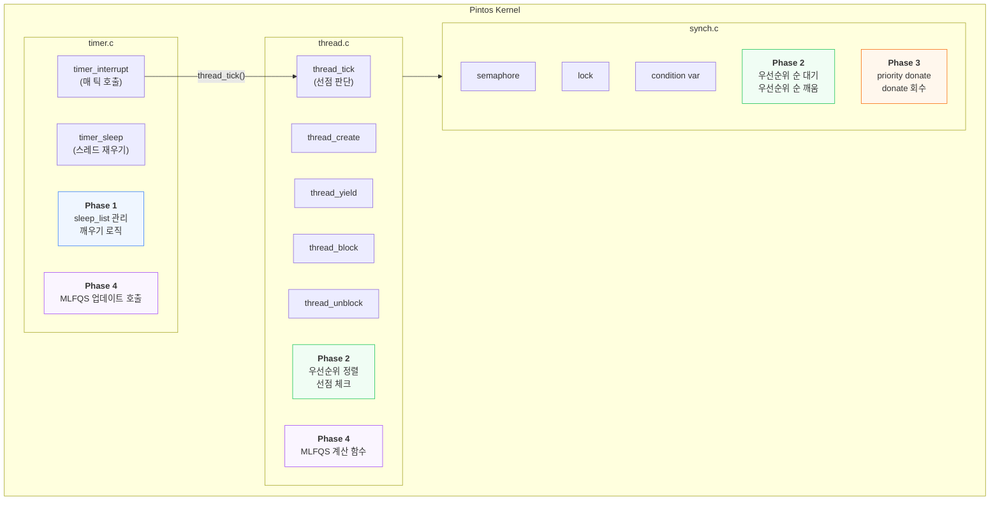
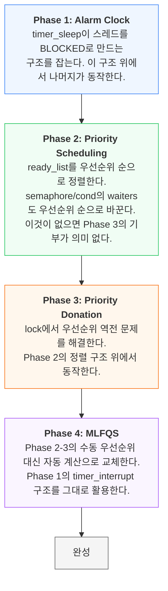
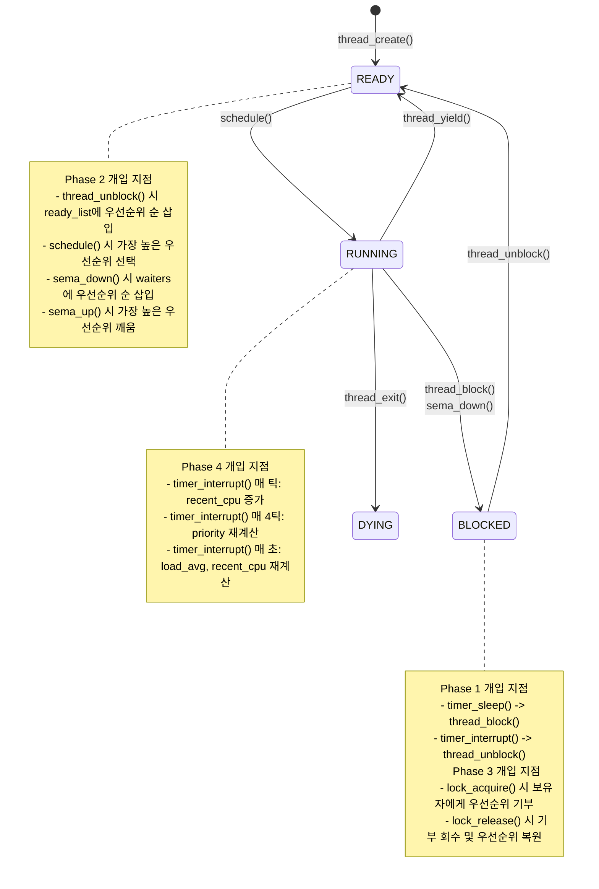
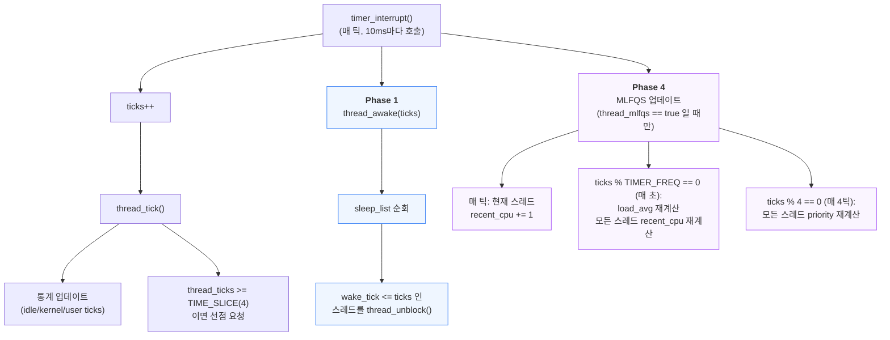
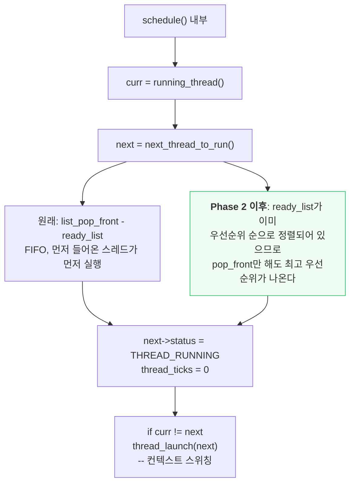
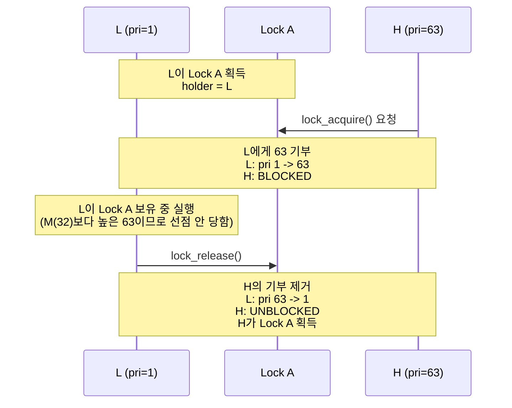
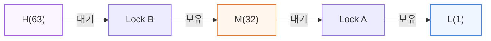
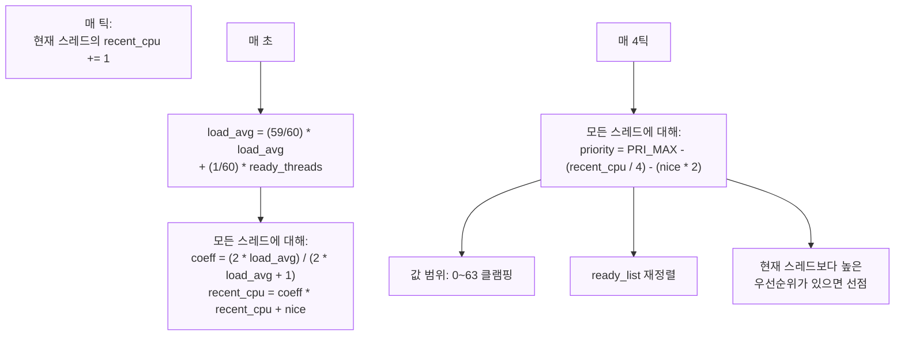
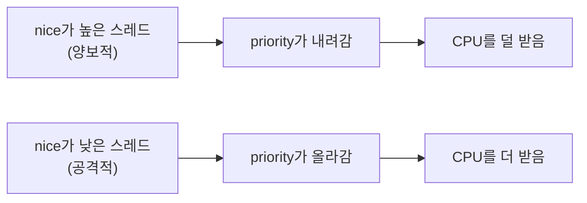
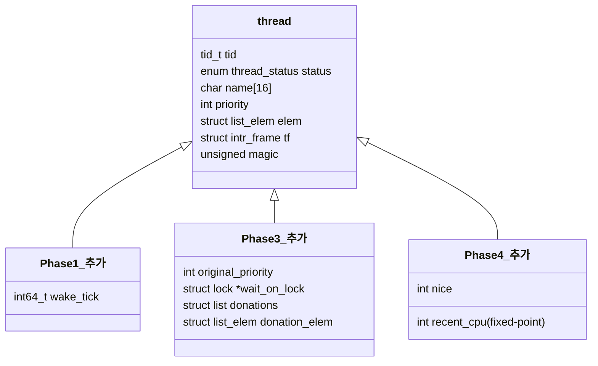

# Project 1 전체 그림: 무엇을 만드는가

## 한 줄 요약

타이머로 스레드를 재우고, 우선순위로 스레드를 고르고, 락으로 우선순위를 넘기고, 수식으로 우선순위를 자동 계산하는 스케줄러를 만든다.

---

## 전체 구조도



---

## Phase별 의존 관계



각 Phase는 이전 Phase의 코드 위에 쌓인다.
Phase 1을 잘못 짜면 Phase 2-4 전부 흔들린다.

---

## 스레드 상태 전이와 각 Phase의 개입 지점



---

## timer_interrupt: 모든 것의 시작점

하드웨어 타이머가 초당 100번 인터럽트를 발생시킨다.
이 하나의 함수가 Phase 1과 Phase 4의 진입점이다.



---

## schedule: 다음 스레드를 고르는 핵심

```
schedule()이 호출되는 경로 4가지:

1. thread_yield()    -> do_schedule(THREAD_READY)    -> schedule()
2. thread_block()    ->                                 schedule()
3. thread_exit()     -> do_schedule(THREAD_DYING)    -> schedule()
4. thread_tick()     -> intr_yield_on_return()        -> thread_yield() -> ...
```



---

## lock과 priority donation: Phase 3의 핵심 흐름



```
기부가 없으면:
  L(1)이 실행 중인데 M(32)이 생성되면
  M이 L을 선점 -> L은 Lock A를 풀 수 없음 -> H(63)는 영원히 대기

기부가 있으면:
  L이 63으로 승격 -> M(32)보다 높음 -> L이 먼저 실행
  -> L이 Lock A 해제 -> H 실행 가능
```

### 중첩 기부 (Nested Donation)



```
donate_priority() 동작:

  curr = H
  lock = Lock B
  depth = 0

  반복 1: Lock B의 holder = M
          M.priority = max(32, 63) = 63
          curr = M, lock = M.wait_on_lock = Lock A
          depth = 1

  반복 2: Lock A의 holder = L
          L.priority = max(1, 63) = 63
          curr = L, lock = L.wait_on_lock = NULL
          depth = 2

  반복 종료 (lock == NULL)

  결과: L(1->63), M(32->63), H(63, BLOCKED)
```

---

## MLFQS: 우선순위 자동 계산 (Phase 4)

Phase 2-3에서는 프로그래머가 우선순위를 직접 지정했다.
Phase 4에서는 스케줄러가 CPU 사용량을 기반으로 자동 계산한다.





### MLFQS 모드에서 비활성화되는 것

```
thread_set_priority()  --> 무시 (스케줄러가 계산)
thread_get_priority()  --> 스케줄러가 계산한 값 반환
priority donation      --> 동작하지 않음
thread_create()의 priority 인자 --> 무시
```

---

## 수정하는 파일과 Phase의 관계



| 파일 | 함수 | 수정 Phase |
|------|------|-----------|
| `devices/timer.c` | `timer_sleep()` | Phase 1 |
| `devices/timer.c` | `timer_interrupt()` | Phase 1, 4 |
| `threads/thread.c` | `thread_create()` | Phase 2 |
| `threads/thread.c` | `thread_unblock()` | Phase 2 |
| `threads/thread.c` | `thread_yield()` | Phase 2 |
| `threads/thread.c` | `thread_set_priority()` | Phase 2, 3, 4 |
| `threads/thread.c` | `init_thread()` | Phase 1, 3, 4 |
| `threads/thread.c` | `next_thread_to_run()` | Phase 2 확인 |
| `threads/thread.c` | `thread_awake()` | Phase 1 추가 |
| `threads/thread.c` | `mlfqs_recalc_priority()` | Phase 4 추가 |
| `threads/thread.c` | `mlfqs_recalc_recent_cpu()` | Phase 4 추가 |
| `threads/thread.c` | `mlfqs_recalc_load_avg()` | Phase 4 추가 |
| `threads/thread.c` | `mlfqs_increment_recent_cpu()` | Phase 4 추가 |
| `threads/synch.c` | `sema_down()` | Phase 2 |
| `threads/synch.c` | `sema_up()` | Phase 2 |
| `threads/synch.c` | `lock_acquire()` | Phase 3 |
| `threads/synch.c` | `lock_release()` | Phase 3 |
| `threads/synch.c` | `cond_signal()` | Phase 2 |
| `threads/fixed_point.h` | (신규 파일) | Phase 4 |

---

## 테스트 통과 순서

각 Phase를 완료하면 아래 테스트가 순서대로 통과해야 한다.

```
Phase 1 완료 후:
  alarm-single .............. PASS
  alarm-multiple ............ PASS
  alarm-simultaneous ........ PASS
  alarm-negative ............ PASS
  alarm-zero ................ PASS

Phase 2 완료 후 (위 + 아래):
  priority-change ........... PASS
  priority-preempt .......... PASS
  priority-fifo ............. PASS
  priority-sema ............. PASS
  priority-condvar .......... PASS
  alarm-priority ............ PASS

Phase 3 완료 후 (위 + 아래):
  priority-donate-one ....... PASS
  priority-donate-multiple .. PASS
  priority-donate-multiple2 . PASS
  priority-donate-nest ...... PASS
  priority-donate-chain ..... PASS
  priority-donate-sema ...... PASS
  priority-donate-lower ..... PASS

Phase 4 완료 후 (위 + 아래):
  mlfqs-load-1 ............. PASS
  mlfqs-load-60 ............ PASS
  mlfqs-load-avg ........... PASS
  mlfqs-recent-1 ........... PASS
  mlfqs-fair-2 ............. PASS
  mlfqs-fair-20 ............ PASS
  mlfqs-nice-2 ............. PASS
  mlfqs-nice-10 ............ PASS
  mlfqs-block .............. PASS
```

Phase를 넘어갈 때 이전 Phase의 테스트가 깨지면 안 된다.
머지 담당자는 `make check` 전체 결과를 확인한 뒤 dev에 올린다.
