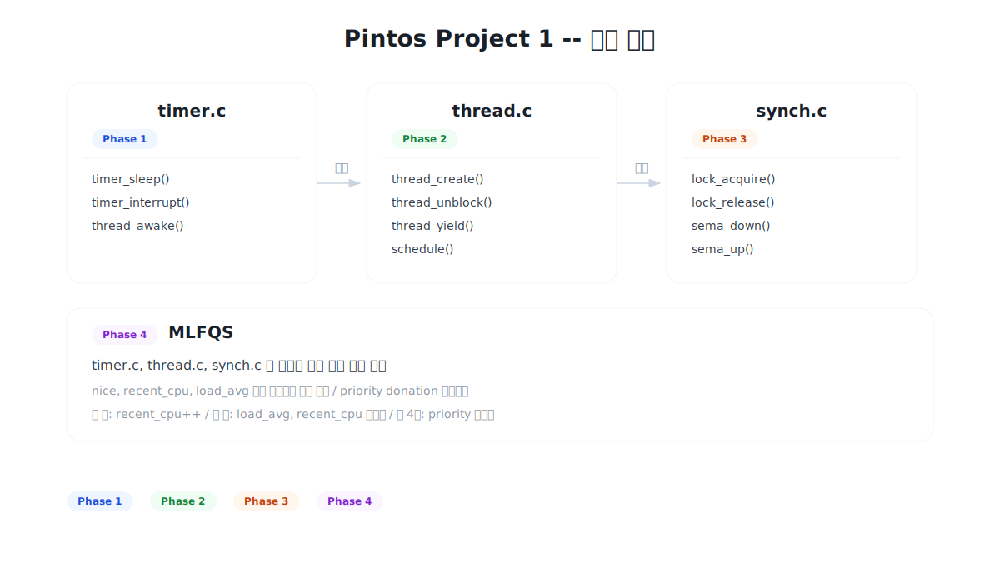
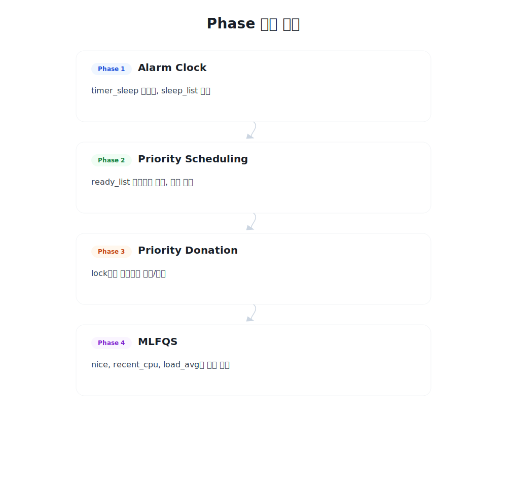
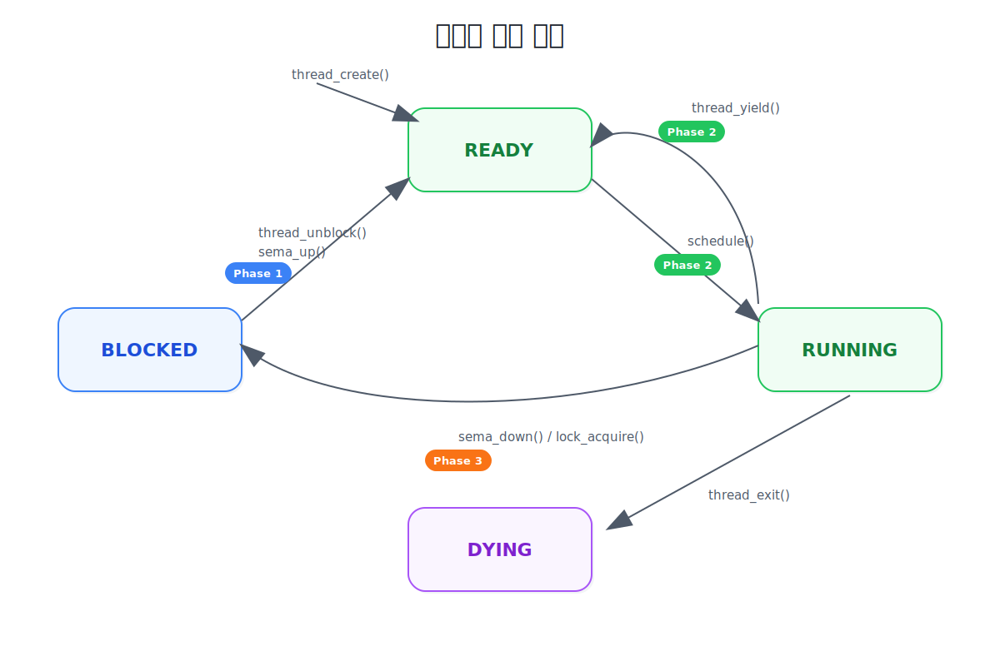
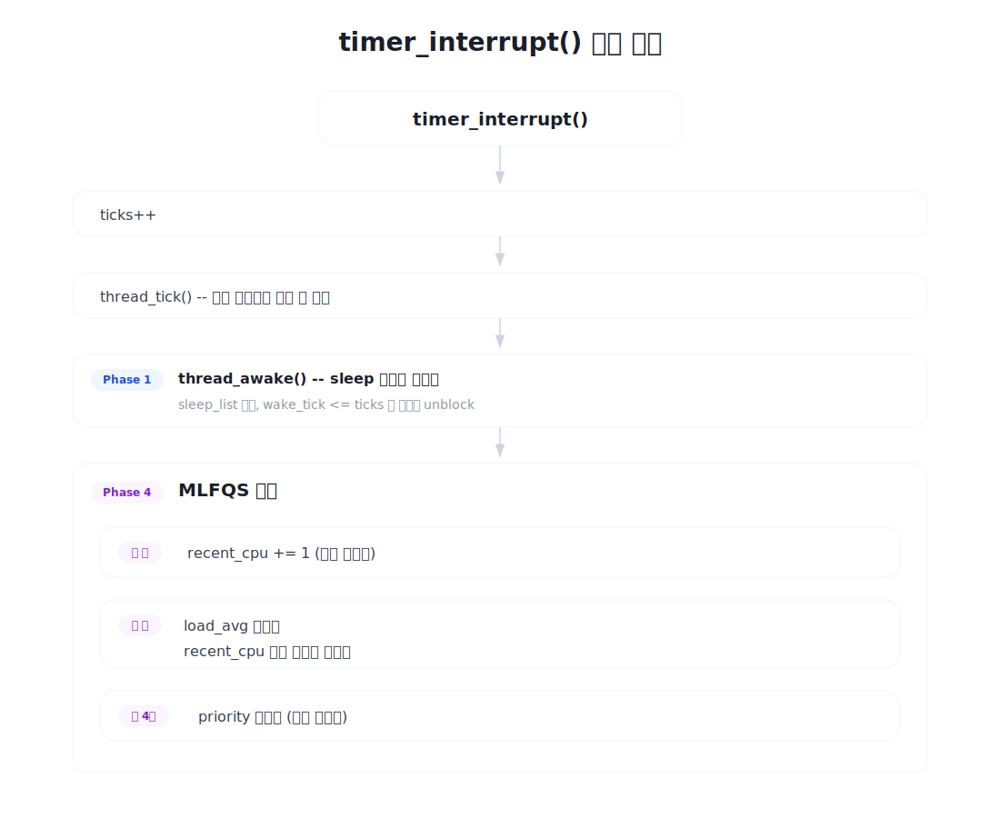
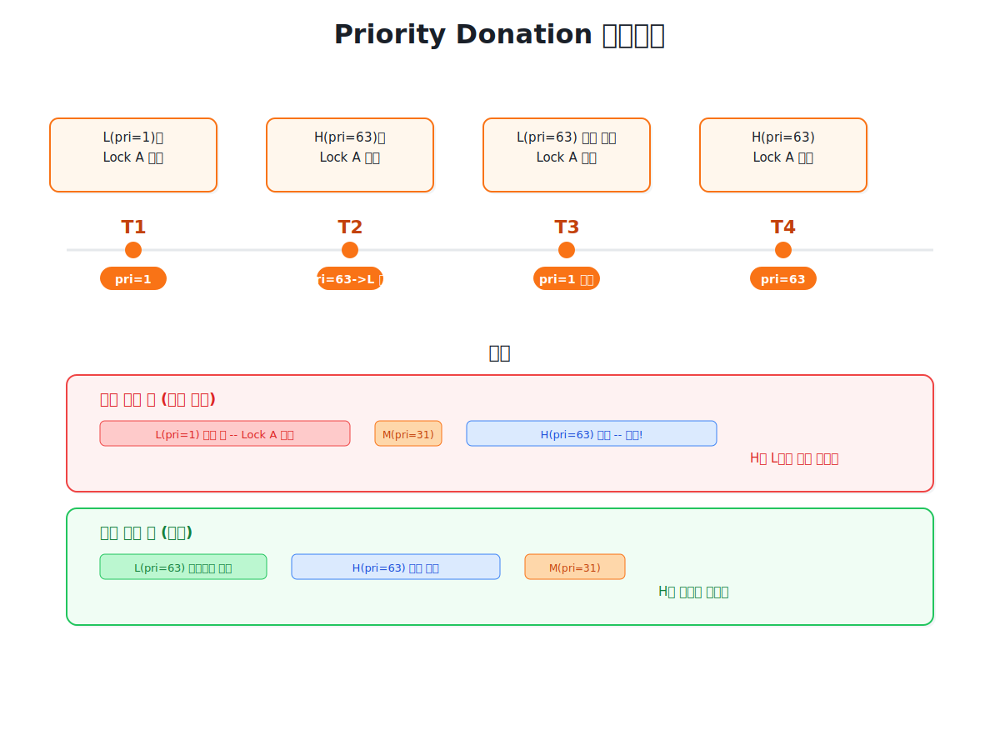
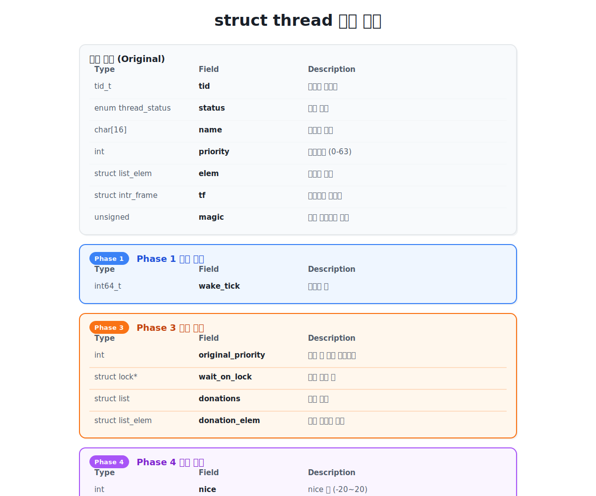

# Project 1 전체 그림: 무엇을 만드는가

## 한 줄 요약

타이머로 스레드를 재우고, 우선순위로 스레드를 고르고, 락으로 우선순위를 넘기고, 수식으로 우선순위를 자동 계산하는 스케줄러를 만든다.

---

## 전체 구조도



```
+================================================================+
|                        Pintos Kernel                           |
|                                                                |
|  +------------------+    +------------------+                  |
|  |   timer.c        |    |   thread.c       |                  |
|  |                  |    |                  |                  |
|  |  timer_interrupt +--->+  thread_tick     |                  |
|  |  (매 틱 호출)     |    |  (선점 판단)      |                  |
|  |                  |    |                  |                  |
|  |  timer_sleep     |    |  thread_create   |                  |
|  |  (스레드 재우기)  |    |  thread_yield    |                  |
|  |                  |    |  thread_block    |                  |
|  |  [Phase 1]       |    |  thread_unblock  |                  |
|  |  sleep_list 관리  |    |                  |                  |
|  |  깨우기 로직      |    |  [Phase 2]       |                  |
|  |                  |    |  우선순위 정렬     |                  |
|  |  [Phase 4]       |    |  선점 체크        |                  |
|  |  MLFQS 업데이트   |    |                  |                  |
|  |  호출             |    |  [Phase 4]       |                  |
|  +------------------+    |  MLFQS 계산 함수  |                  |
|                          +--------+---------+                  |
|                                   |                            |
|                                   v                            |
|                          +------------------+                  |
|                          |   synch.c        |                  |
|                          |                  |                  |
|                          |  semaphore       |                  |
|                          |  lock            |                  |
|                          |  condition var   |                  |
|                          |                  |                  |
|                          |  [Phase 2]       |                  |
|                          |  우선순위 순 대기  |                  |
|                          |  우선순위 순 깨움  |                  |
|                          |                  |                  |
|                          |  [Phase 3]       |                  |
|                          |  priority donate  |                  |
|                          |  donate 회수      |                  |
|                          +------------------+                  |
+================================================================+
```

---

## Phase별 의존 관계



```
Phase 1: Alarm Clock
    |
    |  timer_sleep이 스레드를 BLOCKED로 만드는 구조를 잡는다.
    |  이 구조 위에서 나머지가 동작한다.
    |
    v
Phase 2: Priority Scheduling
    |
    |  ready_list를 우선순위 순으로 정렬한다.
    |  semaphore/cond의 waiters도 우선순위 순으로 바꾼다.
    |  이것이 없으면 Phase 3의 기부가 의미 없다.
    |
    v
Phase 3: Priority Donation
    |
    |  lock에서 우선순위 역전 문제를 해결한다.
    |  Phase 2의 정렬 구조 위에서 동작한다.
    |
    v
Phase 4: MLFQS
    |
    |  Phase 2-3의 수동 우선순위 대신 자동 계산으로 교체한다.
    |  Phase 1의 timer_interrupt 구조를 그대로 활용한다.
    v
  완성
```

각 Phase는 이전 Phase의 코드 위에 쌓인다.
Phase 1을 잘못 짜면 Phase 2-4 전부 흔들린다.

---

## 스레드 상태 전이와 각 Phase의 개입 지점



```
                         thread_create()
                              |
                              v
+--------+   thread_unblock  +--------+   schedule()   +---------+
|        | ----------------> |        | -------------> |         |
| BLOCKED|                   | READY  |                | RUNNING |
|        | <---------------- |        | <------------- |         |
+--------+   thread_block    +--------+   thread_yield +---------+
     |        sema_down                                     |
     |                                                      |
     |                                              thread_exit()
     |                                                      |
     |                                                      v
     |                                                 +---------+
     |                                                 |  DYING  |
     |                                                 +---------+
     |
     |
     +--- Phase 1이 개입하는 지점
     |    timer_sleep() -> thread_block()
     |    timer_interrupt() -> thread_unblock()
     |
     +--- Phase 2가 개입하는 지점
     |    thread_unblock() 시 ready_list에 우선순위 순 삽입
     |    schedule() 시 가장 높은 우선순위 선택
     |    sema_down() 시 waiters에 우선순위 순 삽입
     |    sema_up() 시 가장 높은 우선순위 깨움
     |
     +--- Phase 3이 개입하는 지점
     |    lock_acquire() 시 보유자에게 우선순위 기부
     |    lock_release() 시 기부 회수 및 우선순위 복원
     |
     +--- Phase 4가 개입하는 지점
          timer_interrupt() 매 틱: recent_cpu 증가
          timer_interrupt() 매 4틱: priority 재계산
          timer_interrupt() 매 초: load_avg, recent_cpu 재계산
```

---

## timer_interrupt: 모든 것의 시작점



하드웨어 타이머가 초당 100번 인터럽트를 발생시킨다.
이 하나의 함수가 Phase 1과 Phase 4의 진입점이다.

```
timer_interrupt() (매 틱, 10ms마다 호출)
|
+-- ticks++
|
+-- thread_tick()
|   |
|   +-- 통계 업데이트 (idle/kernel/user ticks)
|   +-- thread_ticks >= TIME_SLICE(4) 이면 선점 요청
|
+-- [Phase 1] thread_awake(ticks)
|   |
|   +-- sleep_list 순회
|   +-- wake_tick <= ticks 인 스레드를 thread_unblock()
|
+-- [Phase 4] MLFQS 업데이트 (thread_mlfqs == true 일 때만)
    |
    +-- 매 틱: 현재 스레드 recent_cpu += 1
    |
    +-- ticks % TIMER_FREQ == 0 (매 초):
    |   +-- load_avg 재계산
    |   +-- 모든 스레드 recent_cpu 재계산
    |
    +-- ticks % 4 == 0 (매 4틱):
        +-- 모든 스레드 priority 재계산
```

---

## schedule: 다음 스레드를 고르는 핵심

```
schedule()이 호출되는 경로 4가지:

1. thread_yield()    -> do_schedule(THREAD_READY)    -> schedule()
2. thread_block()    ->                                 schedule()
3. thread_exit()     -> do_schedule(THREAD_DYING)    -> schedule()
4. thread_tick()     -> intr_yield_on_return()        -> thread_yield() -> ...


schedule() 내부:
+------------------------------------------------------+
|  curr = running_thread()                             |
|  next = next_thread_to_run()                         |
|         |                                            |
|         +-- [원래] list_pop_front(&ready_list)        |
|         |   FIFO, 먼저 들어온 스레드가 먼저 실행       |
|         |                                            |
|         +-- [Phase 2 이후] ready_list가 이미          |
|             우선순위 순으로 정렬되어 있으므로           |
|             pop_front만 해도 최고 우선순위가 나온다    |
|                                                      |
|  next->status = THREAD_RUNNING                       |
|  thread_ticks = 0                                    |
|  if (curr != next) thread_launch(next)  -- 컨텍스트 스위칭 |
+------------------------------------------------------+
```

---

## lock과 priority donation: Phase 3의 핵심 흐름



```
상황: H(63)가 L(1)이 보유한 Lock A를 요청

시간 -->

L이 Lock A 획득         H가 Lock A 요청          L이 Lock A 해제
      |                       |                        |
      v                       v                        v
+----------+           +------------+            +------------+
| L: pri=1 |           | H: pri=63  |            | L: pri=1   |
| Lock A   |           | Lock A 요청 |            | Lock A 해제 |
| holder=L |           |            |            |            |
+----------+           +-----+------+            +-----+------+
                              |                        |
                    lock_acquire()                lock_release()
                              |                        |
                              v                        v
                    +-----------------+        +------------------+
                    | L에게 63 기부    |        | H의 기부 제거     |
                    | L: pri=1 -> 63  |        | L: pri=63 -> 1   |
                    | H: BLOCKED      |        | H: UNBLOCKED     |
                    +-----------------+        | H가 Lock A 획득   |
                                               +------------------+

기부가 없으면:
  L(1)이 실행 중인데 M(32)이 생성되면
  M이 L을 선점 -> L은 Lock A를 풀 수 없음 -> H(63)는 영원히 대기

기부가 있으면:
  L이 63으로 승격 -> M(32)보다 높음 -> L이 먼저 실행
  -> L이 Lock A 해제 -> H 실행 가능
```

### 중첩 기부 (Nested Donation)

```
H(63) --대기--> Lock B --보유--> M(32) --대기--> Lock A --보유--> L(1)

donate_priority() 동작:

  curr = H
  lock = Lock B
  depth = 0

  반복 1: Lock B의 holder = M
          M.priority = max(32, 63) = 63
          curr = M, lock = M.wait_on_lock = Lock A
          depth = 1

  반복 2: Lock A의 holder = L
          L.priority = max(1, 63) = 63
          curr = L, lock = L.wait_on_lock = NULL
          depth = 2

  반복 종료 (lock == NULL)

  결과: L(1->63), M(32->63), H(63, BLOCKED)
```

---

## MLFQS: 우선순위 자동 계산 (Phase 4)

Phase 2-3에서는 프로그래머가 우선순위를 직접 지정했다.
Phase 4에서는 스케줄러가 CPU 사용량을 기반으로 자동 계산한다.

```
+------------------------------------------------------------------+
|                    MLFQS 계산 흐름                                |
|                                                                  |
|  [매 틱]                                                         |
|  현재 스레드의 recent_cpu += 1                                    |
|                                                                  |
|  [매 초]                                                         |
|                                                                  |
|  load_avg = (59/60) * load_avg + (1/60) * ready_threads          |
|       |                                                          |
|       v                                                          |
|  모든 스레드에 대해:                                               |
|  coeff = (2 * load_avg) / (2 * load_avg + 1)                     |
|  recent_cpu = coeff * recent_cpu + nice                          |
|                                                                  |
|  [매 4틱]                                                        |
|       |                                                          |
|       v                                                          |
|  모든 스레드에 대해:                                               |
|  priority = PRI_MAX - (recent_cpu / 4) - (nice * 2)              |
|       |                                                          |
|       +-- 값 범위: [0, 63] 으로 클램핑                            |
|       +-- ready_list 재정렬                                      |
|       +-- 현재 스레드보다 높은 우선순위가 있으면 선점              |
|                                                                  |
+------------------------------------------------------------------+

nice가 높은 스레드        nice가 낮은 스레드
(양보적)                 (공격적)
    |                        |
    v                        v
priority가 내려감         priority가 올라감
    |                        |
    v                        v
CPU를 덜 받음             CPU를 더 받음
```

### MLFQS 모드에서 비활성화되는 것

```
thread_set_priority()  --> 무시 (스케줄러가 계산)
thread_get_priority()  --> 스케줄러가 계산한 값 반환
priority donation      --> 동작하지 않음
thread_create()의 priority 인자 --> 무시
```

---

## 수정하는 파일과 Phase의 관계



```
include/threads/thread.h
+---------------------------------------------+
| struct thread {                              |
|     tid_t tid;                               |
|     enum thread_status status;               |
|     char name[16];                           |
|     int priority;                            |
|     struct list_elem elem;                   |
|                                              |
|     /* Phase 1 추가 */                        |
|     int64_t wake_tick;                       |
|                                              |
|     /* Phase 3 추가 */                        |
|     int original_priority;                   |
|     struct lock *wait_on_lock;               |
|     struct list donations;                   |
|     struct list_elem donation_elem;          |
|                                              |
|     /* Phase 4 추가 */                        |
|     int nice;                                |
|     int recent_cpu;  (fixed-point)           |
|                                              |
|     struct intr_frame tf;                    |
|     unsigned magic;                          |
| };                                           |
+---------------------------------------------+


devices/timer.c
+---------------------------------------------+
| timer_sleep()          <-- Phase 1 수정      |
| timer_interrupt()      <-- Phase 1, 4 수정   |
+---------------------------------------------+


threads/thread.c
+---------------------------------------------+
| thread_create()        <-- Phase 2 수정      |
| thread_unblock()       <-- Phase 2 수정      |
| thread_yield()         <-- Phase 2 수정      |
| thread_set_priority()  <-- Phase 2, 3, 4 수정|
| init_thread()          <-- Phase 1, 3, 4 수정|
| next_thread_to_run()   <-- Phase 2 확인      |
|                                              |
| /* Phase 1 추가 함수 */                       |
| thread_awake()                               |
|                                              |
| /* Phase 4 추가 함수 */                       |
| mlfqs_recalc_priority()                      |
| mlfqs_recalc_recent_cpu()                    |
| mlfqs_recalc_load_avg()                      |
| mlfqs_increment_recent_cpu()                 |
+---------------------------------------------+


threads/synch.c
+---------------------------------------------+
| sema_down()            <-- Phase 2 수정      |
| sema_up()              <-- Phase 2 수정      |
| lock_acquire()         <-- Phase 3 수정      |
| lock_release()         <-- Phase 3 수정      |
| cond_signal()          <-- Phase 2 수정      |
+---------------------------------------------+


threads/fixed_point.h   <-- Phase 4 신규 파일
+---------------------------------------------+
| FP_INT_TO_FP(n)                              |
| FP_FP_TO_INT(x)                              |
| FP_FP_TO_INT_ROUND(x)                        |
| FP_MUL(x, y)                                 |
| FP_DIV(x, y)                                 |
| ...                                          |
+---------------------------------------------+
```

---

## 테스트 통과 순서

각 Phase를 완료하면 아래 테스트가 순서대로 통과해야 한다.

```
Phase 1 완료 후:
  alarm-single .............. PASS
  alarm-multiple ............ PASS
  alarm-simultaneous ........ PASS
  alarm-negative ............ PASS
  alarm-zero ................ PASS

Phase 2 완료 후 (위 + 아래):
  priority-change ........... PASS
  priority-preempt .......... PASS
  priority-fifo ............. PASS
  priority-sema ............. PASS
  priority-condvar .......... PASS
  alarm-priority ............ PASS

Phase 3 완료 후 (위 + 아래):
  priority-donate-one ....... PASS
  priority-donate-multiple .. PASS
  priority-donate-multiple2 . PASS
  priority-donate-nest ...... PASS
  priority-donate-chain ..... PASS
  priority-donate-sema ...... PASS
  priority-donate-lower ..... PASS

Phase 4 완료 후 (위 + 아래):
  mlfqs-load-1 ............. PASS
  mlfqs-load-60 ............ PASS
  mlfqs-load-avg ........... PASS
  mlfqs-recent-1 ........... PASS
  mlfqs-fair-2 ............. PASS
  mlfqs-fair-20 ............ PASS
  mlfqs-nice-2 ............. PASS
  mlfqs-nice-10 ............ PASS
  mlfqs-block .............. PASS
```

Phase를 넘어갈 때 이전 Phase의 테스트가 깨지면 안 된다.
머지 담당자는 `make check` 전체 결과를 확인한 뒤 dev에 올린다.
