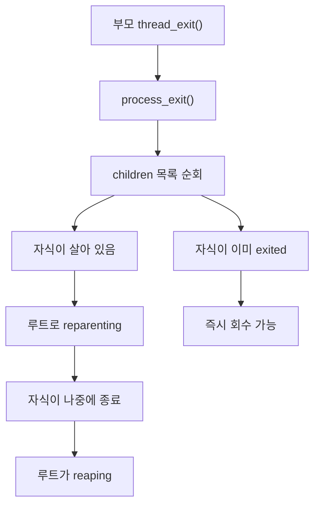
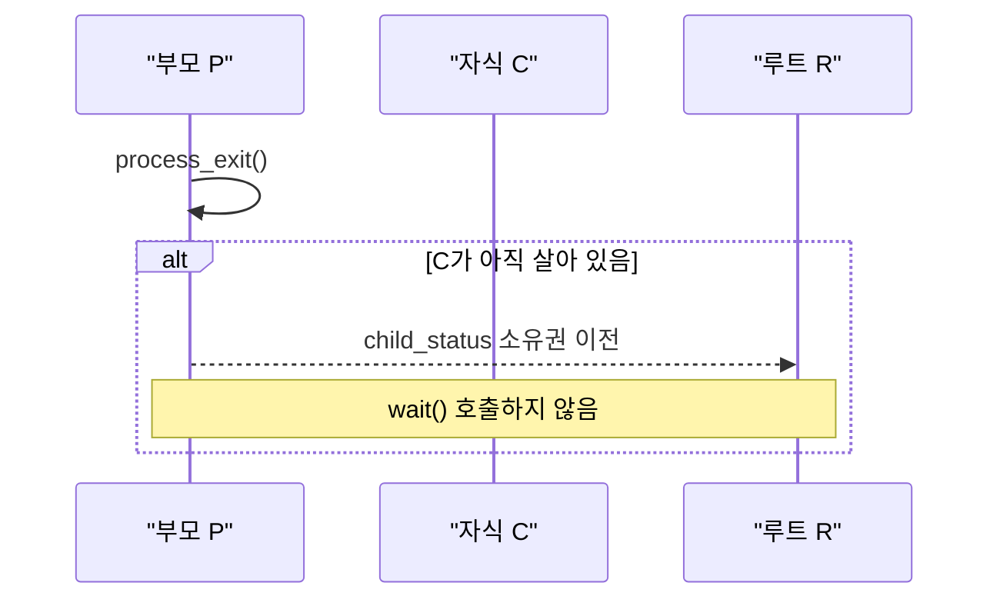
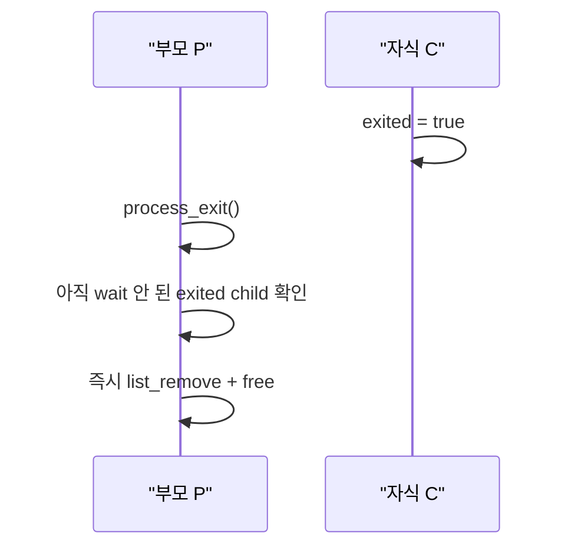
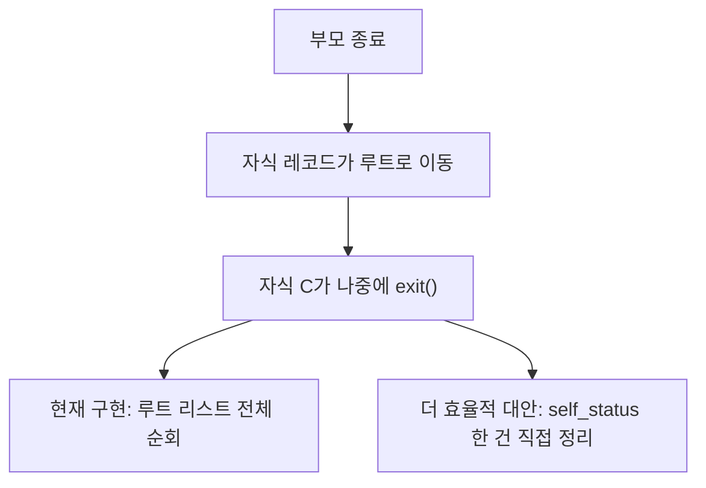
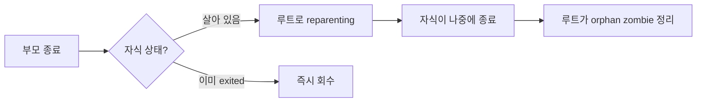

# Orphan Reparenting과 Reaping 판단 정리

## 핵심 질문

Pintos에서 부모가 먼저 종료했을 때 남은 자식 상태를 어떻게 다룰 것인가?

이 문제는 두 질문으로 나뉜다.

1. 부모가 죽을 때 자식 레코드를 루트로 넘길지
2. 루트가 그 레코드를 나중에 어떻게 치울지

이 두 질문을 분리해서 보는 것이 중요하다.

## 현재 구조에서의 기본 해석

- `child_status_list`는 사실상 부모의 children 목록처럼 동작한다.
- `child_status`는 단순 상태 보관용이 아니라 부모가 가진 자식 엔트리 역할도 한다.
- `process_wait(pid)`는 그 children 목록에서 특정 자식 하나를 찾아 회수하는 함수로 볼 수 있다.

즉 현재 구조는 이름만 `child_status`일 뿐, 의미상으로는 이미 children/zombie 모델에 가까운 부분이 있다.

## 왜 부모 종료 중에 `wait()`를 호출하면 안 되는가

`wait()`는 원래 다음 의미를 가진다.

- 자식이 아직 안 죽었으면 기다린다.
- 자식이 죽었으면 종료 코드를 받고 회수한다.

그런데 부모가 `process_exit()` 안에서 이미 죽는 중이라면, 이 시점은 일반 실행 흐름이 아니라 종료 정리 흐름이다.

이때 `wait()`를 호출하면 다음 문제가 생긴다.

1. 자식이 아직 살아 있으면 부모가 block될 수 있다.
2. 그런데 그 부모는 지금 종료 중인 프로세스다.
3. 종료 중인 프로세스가 자식을 기다리며 멈추는 것은 흐름상 맞지 않는다.
4. 따라서 부모 종료 경로에서 `wait()`는 일반 회수 API로 쓰면 안 된다.

정리하면:

- 부모 종료 경로에서는 `wait()`가 아니라
- 상태를 보고
  - 살아 있으면 루트로 넘기고
  - 이미 죽었으면 바로 정리하는 쪽이 자연스럽다.

## 실제 코드 흐름 관점

현재 흐름은 대략 이렇게 본다.

여기서 핵심은 부모가 죽는 시점의 children 엔트리를 자식 상태에 따라 다르게 처리하는 것이다.

## 상황 1: 부모가 죽는 중이고 자식은 아직 살아 있음

조건:

- 부모 P가 `process_exit()`에 들어감
- 자식 C는 아직 실행 중

이때 P가 `wait(C)`를 호출하면:

- C가 아직 안 죽었으니 P는 잠들 수 있다.
- 하지만 P는 지금 종료 중이다.
- 종료 중인 프로세스가 자식을 기다리며 멈추는 것은 잘못된 흐름이다.

따라서 이 경우는:

- `wait()` 금지
- 자식 C의 레코드를 루트로 넘김

한 줄 요약:

`부모 죽는 중 + 자식 아직 살아 있음 -> wait 금지 -> 루트로 넘김`

## 상황 2: 부모가 죽는 중이고 자식은 이미 종료했지만 아직 wait되지 않음

조건:

- 부모 P가 `process_exit()`에 들어감
- 자식 C는 이미 `exited == true`
- 아직 아무도 `wait()`를 하지 않음

이 경우는 기다릴 필요가 없다.

이미 자식은 종료했고, 남은 건 상태 레코드 정리뿐이다.

따라서 이 경우는:

- 굳이 루트로 넘기지 않아도 됨
- 그 자리에서 바로 회수 가능

한 줄 요약:

`부모 죽는 중 + 자식 이미 exited + 아직 wait 안 됨 -> 루트로 넘길 필요 없음 -> 즉시 회수 가능`

## 상황 3: 부모가 먼저 죽어 루트로 넘어간 자식이 나중에 종료함

조건:

- 부모는 먼저 죽어서 자식 레코드를 루트로 넘김
- 자식 C는 나중에 자기 `exit()`를 호출함
- 아무도 아직 `wait()`를 하지 않음

현재 구현은 여기서:

- orphaned 자식이 종료할 때
- 루트 리스트 전체를 훑어서
- `orphaned && exited && !waited`인 레코드를 정리한다

이 방식은 안전하지만 덜 효율적이다.

이유:

- 실제로 방금 종료한 자식은 하나인데
- 루트 리스트 전체를 매번 순회하기 때문이다

더 효율적인 형태는:

- C가 자기 `self_status`를 알고 있으므로
- `orphaned && !waited`라면
- 자기 레코드 하나만 직접 제거/free하는 것

한 줄 요약:

`orphaned 자식이 나중에 종료함 -> 루트 전체 순회보다 자기 레코드 한 건 직접 정리가 더 효율적`

## 현재 구현의 위치

현재 구현은 다음 절충안에 해당한다.

- 부모 종료 시 children 전체를 루트로 reparenting
- orphaned 자식이 나중에 종료할 때만 루트가 미회수 orphan zombie를 정리
- 아무 스레드나 종료할 때마다 전체 sweep하지는 않음

즉:

- 이전의 무차별 sweep보다 효율적
- 하지만 가장 직접적인 per-record 정리보다는 덜 효율적

## 발표용 결론

이 주제의 핵심 메시지는 다음 세 줄로 요약할 수 있다.

1. 부모 종료 경로에서 `wait()`를 호출하면 종료 중인 부모가 block될 수 있으므로 맞지 않다.
2. 부모가 죽을 때는 자식 상태를 보고, 살아 있으면 루트로 넘기고 이미 죽었으면 바로 정리하는 것이 자연스럽다.
3. orphaned 자식이 나중에 종료할 때 루트 전체를 훑는 방식은 안전한 절충안이고, 더 효율적인 방향은 자기 레코드 한 건만 직접 정리하는 것이다.

## 짧은 발표용 도식

