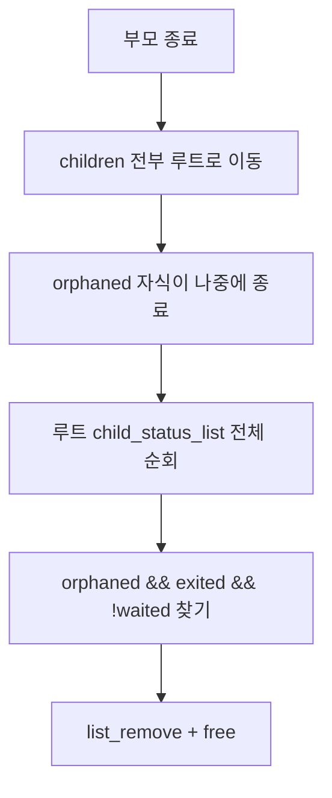
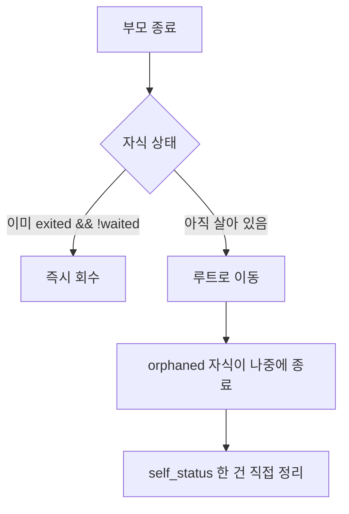
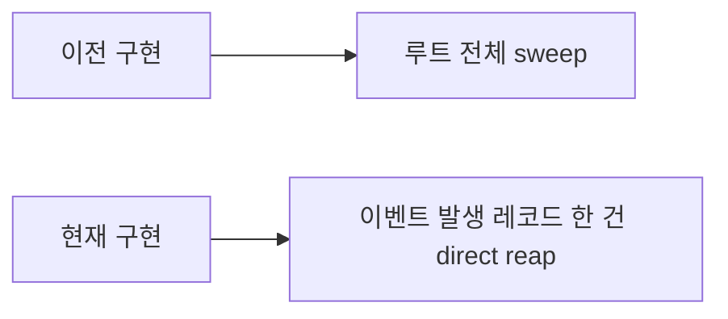

# Orphan Reaping 구현 비교

## 목적

이 문서는 Pintos Project 2에서 orphan 자식 처리 로직의 **이전 구현**과 **현재 구현**을 비교한다.

비교의 핵심은 다음 세 가지다.

1. orphan 자식이 종료했을 때 누가 정리하는가
2. 정리 시점에 전체 리스트를 도는가, 한 건만 처리하는가
3. 부모 종료 경로에서 `wait()`를 호출해야 하는가

## 비교 대상

### 이전 구현

- 부모가 죽으면 자식 레코드를 루트 리스트로 옮긴다.
- orphaned 자식이 나중에 종료하면
  - 루트의 `child_status_list` 전체를 순회해서
  - `orphaned && exited && !waited`인 레코드를 찾고
  - 제거/free 한다.

즉 **루트 전체 sweep 방식**이다.

### 현재 구현

- 부모가 죽으면 children을 순회한다.
- 이미 `exited && !waited`인 자식 레코드는 그 자리에서 바로 정리한다.
- 아직 살아 있는 자식만 루트로 넘긴다.
- orphaned 자식이 나중에 종료하면
  - 자기 `self_status`가 가리키는 레코드 한 건만
  - 직접 `list_remove + free` 한다.

즉 **이벤트가 발생한 레코드 한 건만 직접 정리하는 방식**이다.

## 한 줄 비교

- 이전 구현: orphaned 자식이 죽을 때마다 루트 리스트 전체를 훑는다.
- 현재 구현: orphaned 자식이 죽으면 자기 `self_status` 한 건만 직접 정리한다.

## 흐름 비교

### 이전 구현 흐름



### 현재 구현 흐름



## 핵심 차이 표

| 항목 | 이전 구현 | 현재 구현 |
|------|-----------|-----------|
| 부모 종료 시 처리 | children 전부 루트로 이동 | 이미 죽은 건 즉시 회수, 살아 있는 것만 루트로 이동 |
| orphan 종료 시 처리 | 루트 리스트 전체 순회 | `self_status` 한 건 직접 정리 |
| 정리 단위 | 전체 리스트 기반 | 단일 레코드 기반 |
| 시간 복잡도 감각 | orphan 종료마다 `O(n)` | orphan 종료 시 `O(1)`에 가까움 |
| 불필요한 탐색 | 많음 | 적음 |
| `wait()` 필요 여부 | 없음 | 없음 |
| 기존 `wait(pid)` 의미와 충돌 | 적음 | 적음 |

## 왜 이전 구현이 동작은 맞았는가

이전 구현도 논리적으로는 맞았다.

이유:

- 부모가 죽을 때 자식 레코드를 루트가 이어받는다.
- orphaned 자식이 나중에 종료하면 그 레코드는 `exited == true`가 된다.
- 루트가 전체 리스트를 돌며 회수 가능한 orphan zombie를 찾으면 결국 정리할 수 있다.

즉 **안전성은 확보되지만 효율이 떨어지는 방식**이었다.

## 왜 현재 구현이 더 자연스러운가

현재 구현은 이벤트가 발생한 시점에 필요한 레코드만 직접 처리한다.

### 부모 종료 시

- 자식이 이미 죽어 있다면 더 이상 미래 이벤트를 기다릴 필요가 없다.
- 그래서 루트에 넘기지 말고 그 자리에서 회수하는 것이 자연스럽다.

### orphaned 자식 종료 시

- 지금 죽는 자식은 자기 `self_status`를 이미 알고 있다.
- 따라서 루트 리스트 전체를 다시 찾을 필요가 없다.
- 그 레코드 한 건만 바로 정리하면 된다.

즉 현재 구현은:

- 상태를 더 정확히 구분하고
- 필요한 레코드만 처리하며
- 루트 전체 순회를 줄인다.

## `wait()`를 호출하지 않는 이유

두 구현 모두 공통으로 부모 종료 경로에서 `wait()`를 호출하지 않는다.

이유는 다음과 같다.

- `wait()`는 자식이 아직 살아 있으면 block될 수 있다.
- 그런데 부모는 지금 `process_exit()` 안에서 종료 중이다.
- 종료 중인 프로세스가 자식을 기다리며 잠드는 것은 흐름상 맞지 않다.

따라서 부모 종료 시점에는:

- `wait()` 호출이 아니라
- 상태를 보고
  - 살아 있으면 루트로 넘기고
  - 이미 죽었으면 즉시 정리하는 것이 맞다.

## 코드 구조 비교

### 이전 구현의 특징

- `process_exit()` 내부에서
  - 파일 정리
  - children 루트 이동
  - self_status 종료 표시
  - orphan sweep
  - cleanup
  가 한 함수 안에 길게 섞여 있었다.

### 현재 구현의 특징

- `process_exit()`가 세 helper로 분리되었다.

```text
close_open_files(curr)
reparent_or_reap_children(curr, root)
finish_self_status(curr)
```

이 구조의 장점:

- 각 단계 역할이 분명하다.
- children 정리와 자기 상태 정리가 분리된다.
- 발표나 디버깅 때 설명이 쉬워진다.

## 실제 의미 차이

이전 구현의 질문은 이랬다.

- "orphaned 자식이 죽었을 때 루트가 나중에 누구를 치울 수 있지?"

현재 구현의 질문은 이렇게 바뀐다.

- "지금 이 이벤트에서 바로 정리 가능한 레코드는 누구지?"

즉 관점이:

- **루트 전체 탐색 중심**
에서
- **현재 이벤트 중심**
으로 바뀌었다.

## 장단점 비교

### 이전 구현 장점

- 아이디어가 단순하다.
- orphaned 자식 종료 시 루트가 일괄적으로 처리할 수 있다.

### 이전 구현 단점

- orphan 하나가 죽어도 전체 루트 리스트를 돈다.
- 이미 직접 가리키고 있는 레코드가 있어도 다시 탐색한다.
- `process_exit()` 내부 논리가 길어진다.

### 현재 구현 장점

- 불필요한 루트 전체 순회가 줄어든다.
- 이미 exited 된 children은 부모 종료 시 즉시 정리할 수 있다.
- orphaned 자식 종료 시 자기 레코드 한 건만 처리한다.
- `process_exit()`가 helper 기준으로 더 읽기 쉬워진다.

### 현재 구현 단점

- `self_status` 포인터가 끝까지 정확하다는 전제에 더 의존한다.
- direct-reap 조건을 잘못 두면 `wait()`와의 경합 위험이 생길 수 있다.
- 따라서 `!waited` 조건이 매우 중요하다.

## 발표용 결론

이 구현 변화는 한 문장으로 정리할 수 있다.

**이전 구현은 orphan 종료 시 루트가 전체 리스트를 훑는 방식이었고, 현재 구현은 상태를 더 빨리 구분해 이미 죽은 children은 즉시 정리하고 orphaned 자식은 자기 `self_status` 한 건만 직접 회수하는 방식으로 바뀌었다.**

## 발표용 짧은 도식


