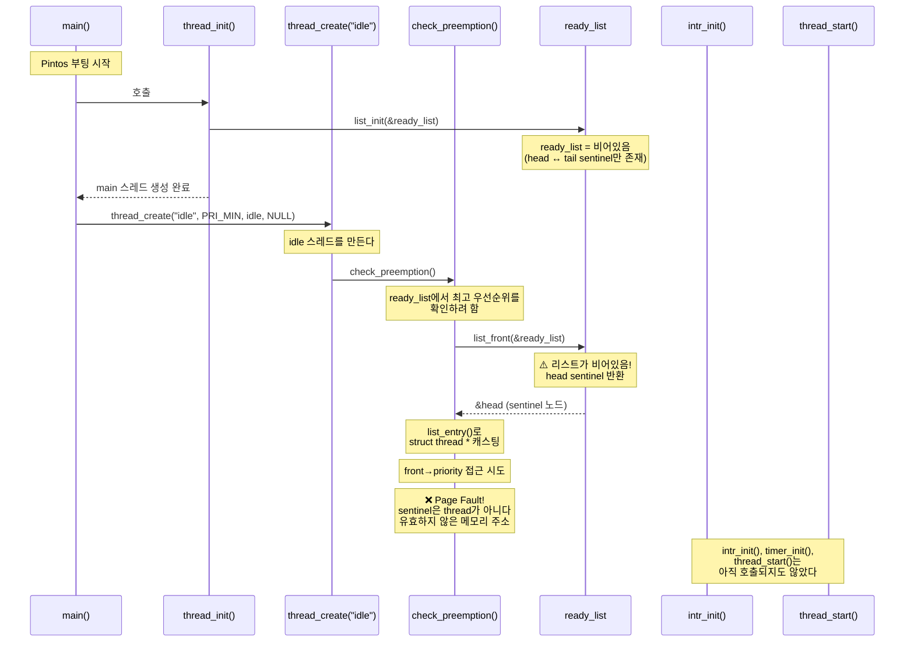
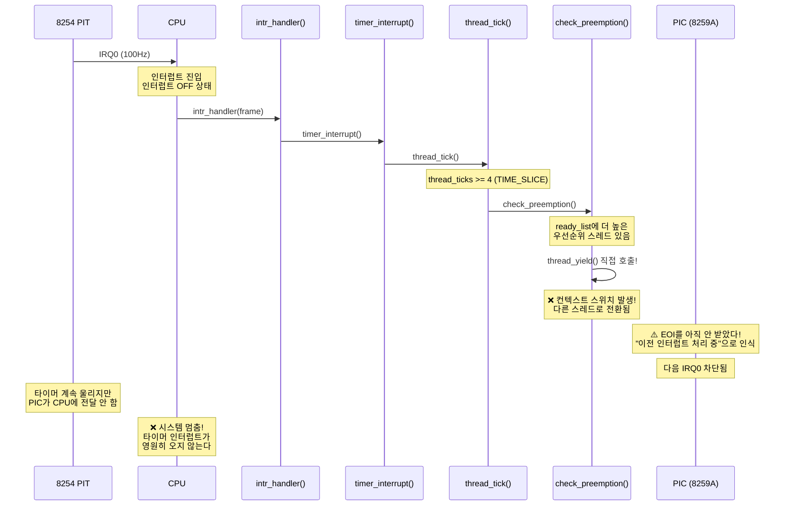
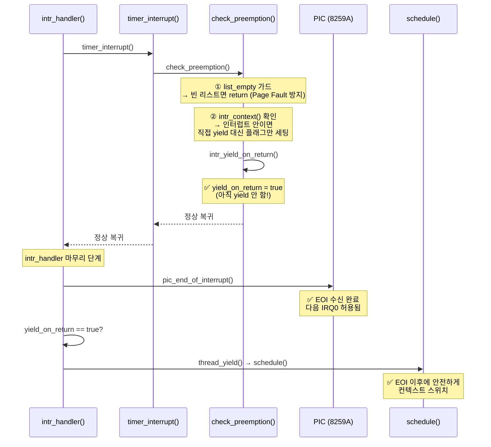
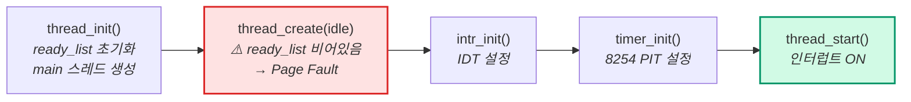
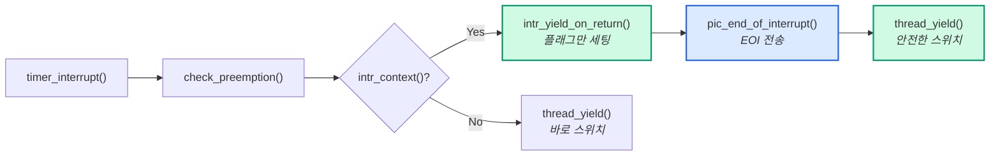
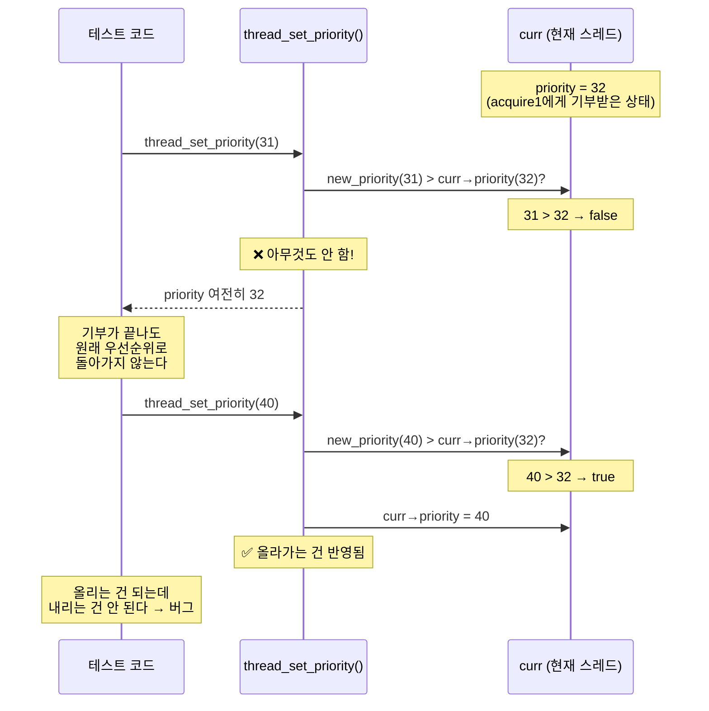
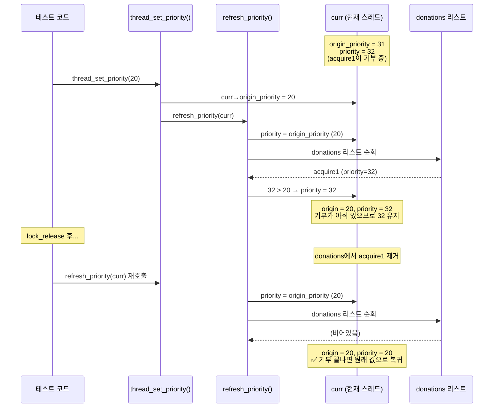
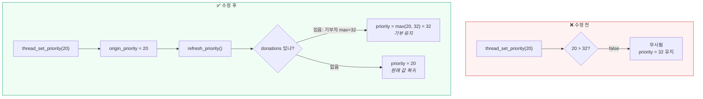

# 버그 시퀀스 다이어그램

## 버그: check_preemption — Page Fault + EOI 문제

하나의 함수에 두 가지 버그가 동시에 존재했다.

---

### 문제 1: 빈 ready_list 접근 → Page Fault

### 문제 2: 인터럽트 안에서 직접 yield → 시스템 멈춤

### 수정 후: 두 문제를 한 함수에서 동시 해결

### 핵심: 부팅 순서와 인터럽트 처리 순서

### 이 함수 하나에 담긴 이해

| 해결한 문제 | 필요한 이해 |
|-----------|----------|
| `list_empty` 가드 | Pintos 부팅 순서 — idle 생성 시점에 ready_list가 비어있다 |
| `intr_context` 분기 | 인터럽트 핸들러는 특수한 상태 — EOI 전에 스위치하면 안 된다 |
| `intr_yield_on_return` | Pintos의 지연 yield 설계 — 핸들러 밖에서 안전하게 yield |

---

## 버그 2: thread_set_priority에서 우선순위가 안 내려감

### 발생 상황 — 수정 전 코드

### 수정 후 — origin_priority + refresh_priority

### Priority Donation과의 연결

