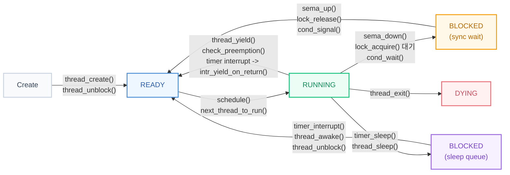
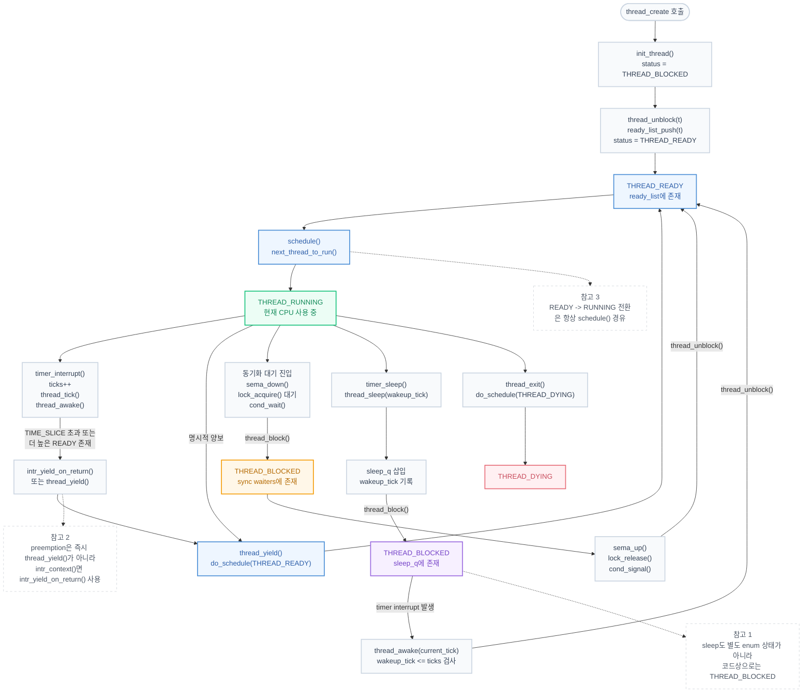

# 현재 구현 기준 스레드 상태 전이

현재 구현 기준 공식 상태는 아래 4개입니다.

- `THREAD_READY`
- `THREAD_RUNNING`
- `THREAD_BLOCKED`
- `THREAD_DYING`

주의:

- `sleep`은 별도 enum 상태가 아니라 `sleep_q`에 들어간 `THREAD_BLOCKED`의 특수한 경우입니다.
- 발표에서는 이해를 위해 `BLOCKED(sync wait)`와 `BLOCKED(sleep queue)`로 나눠 그렸습니다.

## Mermaid 상태도

## 발표용 한 줄 설명

> 현재 구현에서는 `READY`, `RUNNING`, `BLOCKED`, `DYING` 네 상태만 실제로 존재하고,  
> `sleep`은 별도 상태가 아니라 타이머로 깨어나는 `BLOCKED`의 한 종류입니다.

## Mermaid 상세 버전

아래 버전은 GitHub에서 그대로 렌더링하기 좋은 `flowchart` 기반 상세 상태도입니다.

## 발표용 설명 포인트

- `thread_create()` 직후 스레드는 바로 `RUNNING`이 아니라, 먼저 `THREAD_READY`로 `ready_list`에 들어갑니다.
- `READY -> RUNNING` 전환은 항상 `schedule()`을 거칩니다.
- `sleep`과 `sync wait`는 논리적으로 다르지만, 코드상 상태값은 둘 다 `THREAD_BLOCKED`입니다.
- 타이머 인터럽트는 단순히 시간을 올리는 게 아니라 `thread_tick()`과 `thread_awake()`를 통해 선점과 wakeup을 동시에 담당합니다.
- 인터럽트 컨텍스트 안에서는 곧바로 `thread_yield()`하지 않고 `intr_yield_on_return()`로 복귀 직후 스케줄링을 예약합니다.
