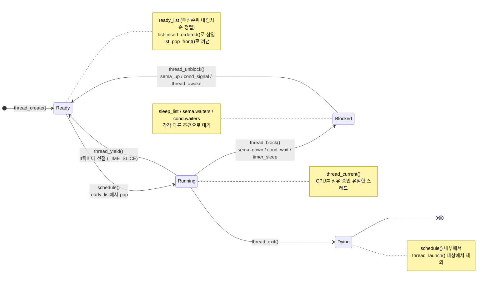
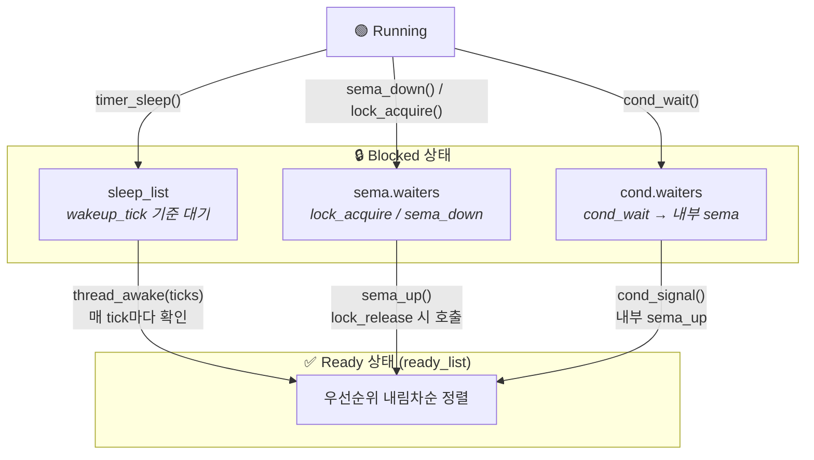
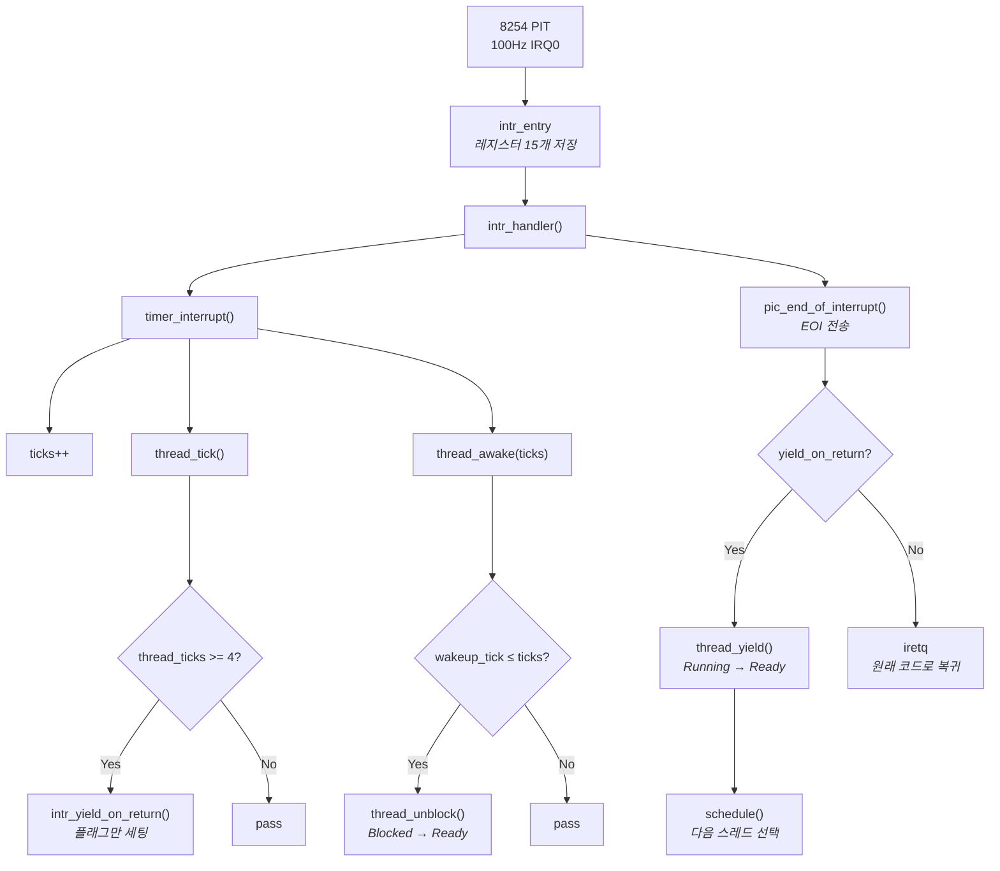
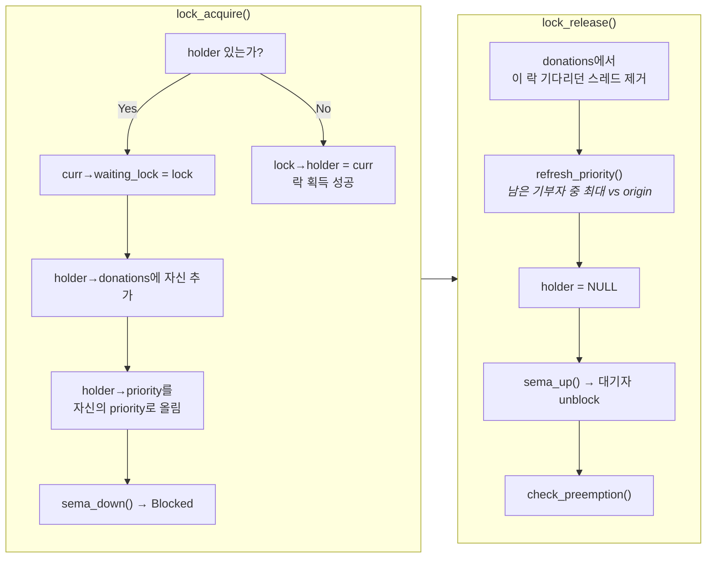

# Pintos 스레드 상태 전환 다이어그램

## 1. 스레드 상태 전환 (전체 흐름)



## 2. Blocked 상태 세부 — 대기 큐별 진입/탈출



## 3. timer_interrupt 구동 흐름



## 4. Priority Donation 흐름



## ASCII 버전 (Mermaid 미지원 환경용)

```
                        thread_create()
                              │
                              ▼
┌──────────┐  schedule()  ┌──────────┐  thread_exit()  ┌──────────┐
│  Create  │────────────▶│  Ready   │───────────────▶│  Dying   │
└──────────┘             │(ready_  │                 └──────────┘
                          │  list)  │                       ▲
                          └────┬────┘                       │
                               │                      thread_exit()
                    schedule() │                            │
                               ▼                            │
                    ┌─────────────────────┐                 │
     thread_yield() │                     │                 │
     Time-out/선점  │      Running        │─────────────────┘
          ┌─────────│  thread_current()   │
          │         │                     │
          │         └──────────┬──────────┘
          │                    │
          │         thread_block()
          │                    │
          │                    ▼
          │         ┌─────────────────────┐
          │         │                     │
          │         │      Blocked        │
          │         │  sleep/sema/cond    │
          │         │                     │
          │         └──────────┬──────────┘
          │                    │
          │         thread_unblock()
          │         sema_up / thread_awake
          │                    │
          ▼                    ▼
        ┌──────────────────────────┐
        │          Ready           │
        │   (우선순위 내림차순 정렬)  │
        └──────────────────────────┘
```

## Blocked 세부 대기 큐

```
                    ┌─────────────────────┐
                    │      Blocked        │
                    └─────────┬───────────┘
                              │
              ┌───────────────┼───────────────┐
              │               │               │
              ▼               ▼               ▼
     ┌──────────────┐ ┌──────────────┐ ┌──────────────┐
     │  sleep_list  │ │sema.waiters  │ │cond.waiters  │
     │              │ │              │ │              │
     │thread_awake()│ │  sema_up()   │ │cond_signal() │
     └──────────────┘ └──────────────┘ └──────────────┘
```

## timer_interrupt가 구동하는 전환

```
★ timer_interrupt() — 매 tick (100Hz) 마다 호출

  ├── ticks++
  ├── thread_tick()
  │     └── 4틱마다 → intr_yield_on_return()  ← Running → Ready 전환 유발
  └── thread_awake(ticks)
        └── wakeup_tick ≤ ticks인 스레드 → thread_unblock()  ← Blocked → Ready 전환

→ 이 두 경로가 스레드 상태 전환의 원동력
```
